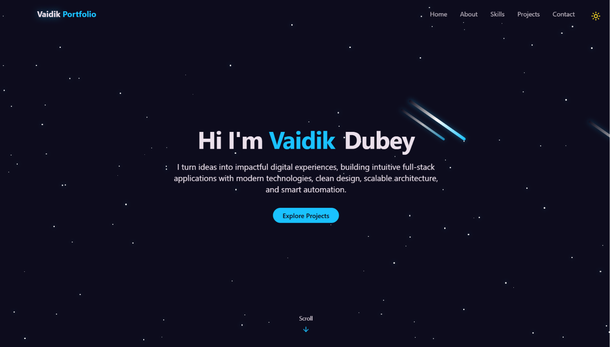
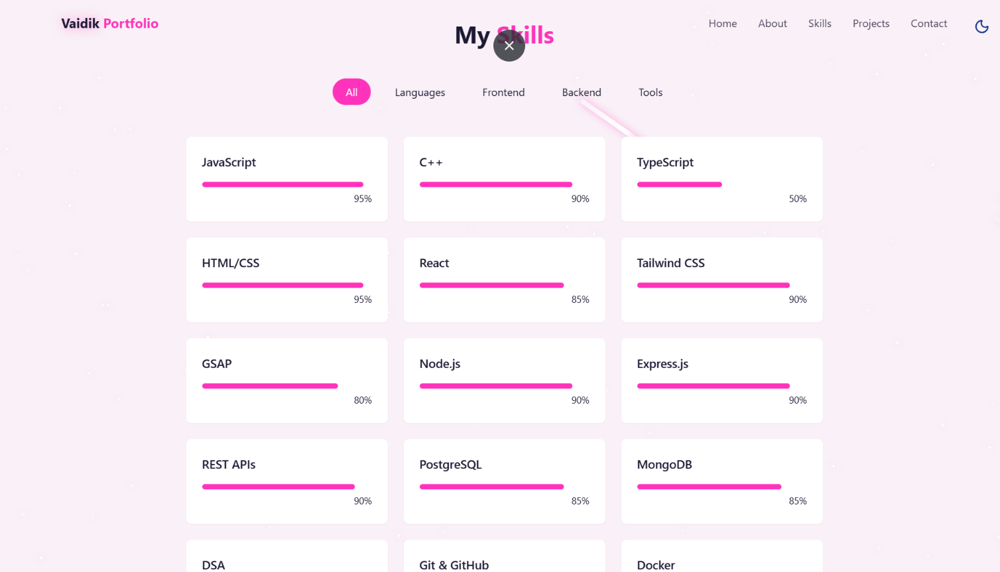

# [ 🚀 Personal Portfolio Website](https://heyvaidik.vercel.app/)

A modern and responsive developer portfolio built with **React** and **Tailwind CSS** to showcase my projects, technical skills, and professional journey.

This portfolio serves as my personal website where recruiters, developers, and potential collaborators can learn more about me, explore my projects, and get in touch.

## 🌐 Live Demo

### [Vaidik Portfolio🔗](https://heyvaidik.vercel.app/)

## ✨ Features

- 🎨 Modern and responsive UI
- ⚡ Smooth animations and transitions
- 💼 Project showcase section
- 🛠️ Skills & technologies overview
- 📬 Contact form
- 📱 Mobile-friendly design
- 🚀 Optimized performance

## 🛠️ Tech Stack

### Frontend

- React.js
- Tailwind CSS
- Vite

### Other Tools

- JavaScript (ES6+)
- Git
- GitHub
- Vercel (deployment)

## 📂 Project Structure

```text
portfolio/
├── app/
    ├── public/
    ├── src/
    │   ├── assets/
    │   ├── components/
    │   ├── lib/
    │   ├── pages/
    │   ├── utils/
    │   ├── App.jsx
    │   ├── index.css
    │   └── main.jsx
    ├── package.json
└── README.md
```

## 🚀 Getting Started

### 1. Clone the repository

```bash
git clone https://github.com/your-username/portfolio.git
```

### 2. Navigate to the project

```bash
cd portfolio/app
```

### 3. Install dependencies

```bash
npm install
```

### 4. Add environment variables

Create a `.env` file in the root directory and add the necessary environment variables as defined in the `.env.example` file.

### 5. Start the development server

```bash
npm run dev
```

The application will be available at:

```text
http://localhost:5173
```

## 📸 Screenshots

### Hero Section



### Skills Section



## 📬 Contact

If you'd like to connect, collaborate, or discuss opportunities, feel free to reach out through the contact section of my portfolio or connect with me on [LinkedIn](https://www.linkedin.com/in/vaidik-dubey/).

---

⭐ If you found this project interesting, consider giving it a star!
